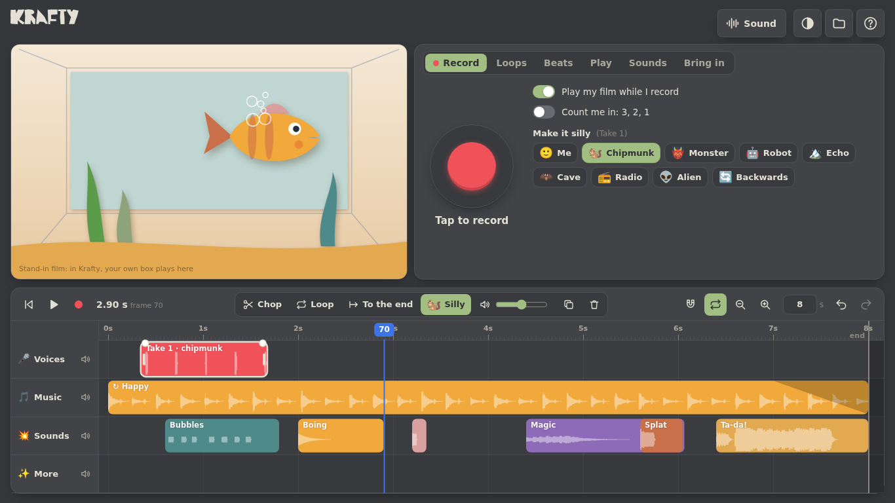

# Krafty Sound: the Sound room

The Sound room for Krafty, built on its own first (as the Paint and Assets rooms were) so it
can be tried and changed quickly, then dropped into `krafty_webapp` as the room that's
already waiting there (`ROOMS` in `src/main.js`: `{ id: 'sound', later: true }`).



Record your voice, make it silly, add loops, beats, tunes, boings and mp3s, and chop them
up on a little timeline under your film. It's simple, direct and joyous, and made for a
ten-year-old on a ChB.

## Run it

```
./serve.sh
```

Then open `http://localhost:8776`. The microphone needs `localhost` or https: on a ChB or
iPad on the same wifi, use an https host (Cloudflare Pages, as Krafty does). Everything
else works over plain http.

No build step, no install, no samples to download. It's plain JS modules, like Krafty.

## What's in it

The screen is laid out like Krafty's Animate room: the film top left, the sound box top
right, the timeline under them. Everything you make lands on the timeline as a clip of
plain sound, so a voice, a loop, a beat, a tune, a boing and an mp3 all move, chop,
loop, fade and go silly the same way.

- **Record.** A big red button. **Play my film while I record** (on by default) plays the
  timeline as you talk, so the voice lines up with the picture. There's a 3-2-1 count-in.
  The quiet before and after a take is trimmed off without moving its timing, and quiet
  voices are brought up.
- **Make it silly:** Me, Chipmunk, Monster, Robot, Echo, Cave, Radio, Alien, Backwards. Tap
  one to hear it at once. Each voice is made from the plain take, so voices never stack,
  and **Me** puts it back. They work on any sound that doesn't loop, including a brought-in mp3.
- **Loops:** eight little bands in a mood (Happy, Sneaky, Chase!, Sleepy, Disco, Pirate,
  Space, Jungle), four bars each, made to go round without a click.
- **Beats:** a 7 × 16 drum grid (Boom, Bap, Clap, Tss, Tsss, Tom, Bell), drag across it to
  paint, with five starting beats, three kits, and a Slow to Fast slider. **Try it** plays
  it live while you change it.
- **Play:** ten coloured pads on a pentatonic scale, so every note sounds good with every
  other, and six instruments. Keys `1`–`0` play them too. **Record a tune** plays the film
  while you tap.
- **Sounds:** 29 silly sounds: boing, pop, whoosh, zap, pew pew, splat, ta-da!, honk,
  raspberry, slide whistles, coin, magic, kaboom, drum roll, snip, thunk, tink, doorbell,
  heartbeat, hooray, bubbles, thunder… Tap one to hear it, then drag it onto the timeline.
- **Bring in:** an mp3, wav, m4a, ogg or a phone video's sound. Drop it anywhere or pick it.
  On a ChB the picker reaches Google Drive, so a sound recorded on a phone gets in that
  way. A long song is cut to the film's length (drag its end to hear more).

### The timeline

- Lanes: Voices, Music, Sounds, More (up to six), each with a hush button. A new sound
  goes on the lane it suits, or the next free one.
- Drag a sound to move it, drag its ends to trim it, and drag its top corners to fade it.
  Tap one to hear it on its own.
- **Chop** (`S`) cuts at the playhead. **Loop** makes it go round as you stretch it.
  **To the end** stretches it to the end of the film (a short one starts looping). There's
  also **Silly**, a volume slider, **Copy** (`Ctrl D`) and **Throw away** (`Delete`).
- It counts in Krafty's frames (24 a second): the playhead shows the frame number, and
  sounds snap to frames. The magnet snaps to the beat instead. Sounds always snap gently
  to the playhead, the start, the end and each other.
- Pinch or `Ctrl` + wheel to zoom. Use a plain wheel or a two-finger slide to move along.
- The film grows to fit what's on it. The seconds box sets its length.
- `Space` plays (round and round, as Krafty's timeline does: `L` turns that off), `R`
  records, `,` `.` step a frame, and `Ctrl Z` / `Ctrl Shift Z` undo and redo everything.

### Keeping it

- Saved as you go, in this browser (IndexedDB).
- **Files ▸ Save…** makes a `.ksound` file and **Open…** opens one. It's a small JSON header
  followed by the sounds as 16-bit samples (`src/store.js`).
- **Save as a sound (.wav)** mixes the whole film down to one WAV, for anywhere.
- **Show me an example** builds a little scene to play with.

### The film

In Krafty, the room's viewer plays your own box. Standing in for it here is a paper fish in
a paper box, so sound and picture can be seen lining up. It swims with the playhead, its
mouth opens with the voices (and with the microphone while you record: a first taste of
lip-sync), it bobs to the music and blows bubbles at the silly sounds.

## Made for the ChB

- Fits 1366 × 768 with nothing scrolling. Below 820 px wide the film tucks away and the
  rest stacks.
- Touch, pen and mouse all use pointer events. The big targets are for fingers.
- Light on the 4 GB: every sound is mono (three minutes of song is about 35 MB), and a
  sound is never copied, since clips only point at it. Undo snapshots are just numbers.
- Light on the chip: the timeline is drawn to a cached picture only when something
  changes, and each frame only draws the playhead over it. The film is drawn only while
  playing or scrubbing.
- Classroom-friendly microphone: noise suppression, echo cancellation (so the film playing
  through the speakers isn't recorded) and automatic loudness. The microphone is let go
  when the tab is hidden.
- Nothing to download: every instrument, drum and sound effect is synthesised with Web
  Audio. The instruments and kits are cut down from Ditty (`inkmotor/ditty-offky`).

## Files

| | |
|---|---|
| `index.html` | The page: top keys, film, sound box, timeline |
| `src/main.js` | The room: tabs, recording, silly voices, loops, beats, pads, sounds, bringing in, clip tools, files, keys |
| `src/state.js` | The project, its undo, which lane a sound goes on |
| `src/timeline.js` | The timeline: drawing, dragging, trimming, fades, snapping, zoom, drops from the sound box |
| `src/audio.js` | The engine: playing the timeline, the microphone, decoding files, silly voices, mixdown, WAV |
| `src/synth.js` | Instruments, drum kits, silly sounds and loops, and rendering them to sound |
| `src/viewer.js` | The stand-in film |
| `src/store.js` | Autosave (IndexedDB) and `.ksound` files |
| `src/style.css` | Krafty's look (soft charcoal and paper white), and the room's own bits |

## Putting it in Krafty

The pieces are built to move across as they are:

1. Copy `src/audio.js`, `src/synth.js`, `src/timeline.js` and `src/state.js` (rename it
   `src/soundroom-state.js`, say) into `krafty_webapp/src`, with the room's UI from
   `src/main.js` as `src/soundroom.js`, like `src/paintroom.js`. Mark it all
   `// SUPREME: rooms`.
2. In `ROOMS`, drop `later: true` from `sound`. In `setRoom`, add `body.room-sound` and lay
   it out as Animate: the viewer top left, the sound box top right, the timeline below.
3. The film: swap `src/viewer.js` for Krafty's viewer at `S.playhead`. Krafty's
   `state.frame` is `S.playhead * 24`, and `state.anim.frames / fps` is the film's length.
   Scrubbing either timeline moves both.
4. Saving: put the `.ksound` header (project + sound list) in the `.krafty` scene as
   `sound`, and the samples alongside, with the autosave as it is here.
5. Juice: the silly sounds are ready for `business/beauty-and-juice.md` (snip, thunk, tink).
6. Tiers: the room is Supreme. TRY's 6-second timeline limit would apply here too.
7. Next: play the sound in the Animate room's timeline too, show the voice's wave under
   the dope sheet, and lip-sync, by swapping replacement mouths on the voice's loudness
   (`levelAt` in `src/main.js` already gives it, frame by frame).

---

© 2026 Matthew Thomas Lloyd. All rights reserved.
